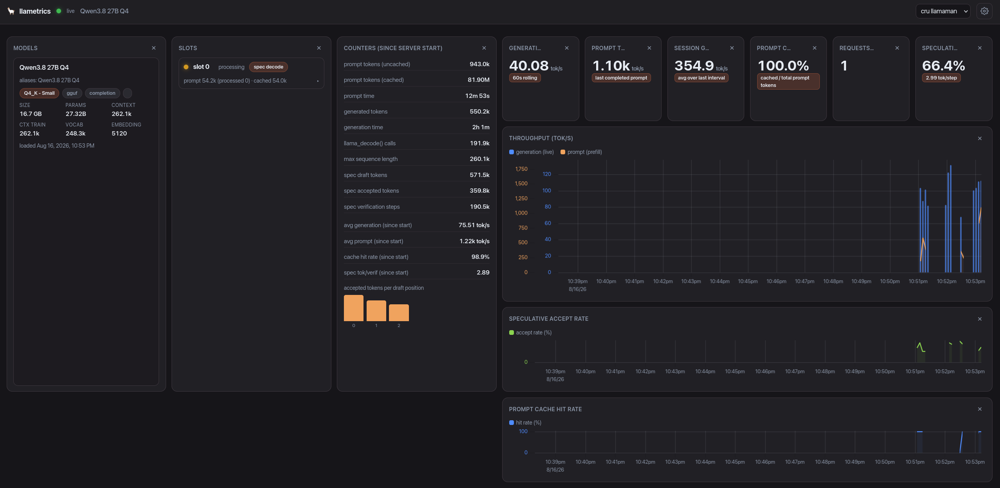

# 🦙 llametrics

A modern, themeable, customizable web dashboard for **llama-server** metrics.
Pure static SPA — no backend: your browser polls the llama-server's
`/metrics`, `/models`, `/slots`, and `/health` endpoints directly.



## Features

- **Live KPIs**: generation/prompt throughput (tok/s), prompt cache hit rate,
  speculative-decode accept rate + tokens per verification step, requests in
  flight / deferred — all computed from the server's Prometheus counters with
  restart-safe deltas. The prompt KPI shows the live prefill rate while a
  prompt is processing, and otherwise **holds the last completed prompt's
  prefill speed** (non-cached tokens only — `Δprompt_tokens /
  Δprompt_seconds`, which excludes cache hits), so a 99%-cached workload
  still shows its real prefill capability instead of ~0.
- **Time-series charts** (uPlot) over **7 days of persisted history**
  (IndexedDB, per server, raw ticks, min/max downsampled for display).
  Hover any chart for the exact value at each point; the tok/s chart puts
  generation (thin bars, left axis) and prefill (step line holding the last
  prompt, right axis) on **dual y-axes** so ~1,000 tok/s prefill and
  ~80 tok/s generation stay equally readable; rate charts plot 0–100%.
- **Freeform board**: every widget is draggable anywhere and resizable in
  both dimensions (1–12 grid columns × rows), with the layout persisted per
  endpoint. On narrow screens widgets stack in order.
- **Model cards** from `/models`: quantization, size, parameters, context,
  vocab, embedding dim, aliases, tags.
- **Slot strip** from `/slots`: busy/idle per slot, spec-decode status,
  expandable sampling params.
- **Multiple saved endpoints** — switch llama-server instances with one click.
- **Theming**: light/dark/system, five named palettes, accent color picker —
  everything is CSS custom properties.
- **Customizable**: poll interval (1–60 s, auto-pause when the tab is
  hidden), chart window (5 min – 3-day presets, default 15 min), number
  formatting (human/raw), widget show/hide.
- **Resilient**: on disconnect, last data stays visible with a *stale* badge
  and auto-reconnect (exponential backoff 1 s → 30 s). CORS-blocked targets
  get an actionable diagnostic.
- **Settings** persist in `localStorage` and can be exported/imported as JSON.

## Quick start

**Install from npm** (prebuilt — just needs Node ≥ 20 to run the CLI):

```bash
npm i -g @gondor/llametrics
llametrics                      # → http://127.0.0.1:9100, opens the browser
```

Enter your llama-server base URL (e.g. `http://10.0.0.57:9080`) and Connect —
or prefill it: `llametrics --base-url http://10.0.0.57:9080`.

### From source

```bash
npm install
npm run dev          # Vite dev server on http://localhost:5173
npm run build        # → dist/ (relative-base, deployable to any static host)
npm start            # serve dist/ via the bundled CLI (127.0.0.1:9100)
```

`dist/` can also be served from any static file server.

CLI options:

| Flag            | Default     | Meaning                                   |
| --------------- | ----------- | ----------------------------------------- |
| `--port <n>`    | `9100`      | listen port                               |
| `--host <addr>` | `127.0.0.1` | bind address                              |
| `--base-url`    | —           | prefill the llama-server URL in the UI    |
| `--no-open`     | —           | don't auto-open the browser               |
| `--version`     | —           | print version and exit                    |

## Requirements

- **Node ≥ 20** (npm is the canonical package manager; the package is also
  Bun-compatible).
- The target llama-server must allow CORS from the dashboard's origin.
  llama.cpp's default is `--cors-origins *` (open); if you run a restricted
  server, either allow your dashboard's origin or serve llametrics from the
  same origin as the llama-server.

## Data sources

| Endpoint    | Used for                                                        |
| ----------- | --------------------------------------------------------------- |
| `/metrics`  | Prometheus text: 10 counters, 5 gauges, spec-decode per-position |
| `/models`   | Model names, tags, capabilities + numeric details (`data[]`)    |
| `/slots`    | Per-slot busy state, **live tok/s while tasks are processing**, prompt tokens, sampling params |
| `/health`   | Connection status indicator                                     |

## Development

```bash
npm test           # vitest: parser, metrics math, layout engine, chart data
                   # paths, formatting, settings, app smoke
npm run typecheck  # tsc -b (strict)
npm run build      # tsc + vite build
```

- Live-server fixtures used by the tests live in `src/lib/__fixtures__/`.
- The app smoke test (`src/__tests__/app.smoke.test.tsx`) renders the full
  App under jsdom against mocked endpoints (live fixtures).
- `node scripts/mock-server.mjs` runs a **dynamic fake llama-server**
  (incrementing counters, bursty slots, /models, /health) for local
  development and browser-level testing without a real GPU box.

## Project layout

```
bin/llametrics.mjs     zero-dependency CLI that serves dist/
scripts/mock-server.mjs  dynamic fake llama-server for dev/tests
src/lib/               prometheus parser, metrics math, api, settings,
                       history (IndexedDB), layout engine (freeform board),
                       polling/dashboard engine — framework-free
src/hooks/             React hooks (history view, resolved CSS vars)
src/widgets/           widget registry + chart/KPI/model/slot/counters widgets
src/components/        top bar, settings modal, onboarding
src/theme.ts           theme engine (mode × palette × accent → CSS vars)
```
